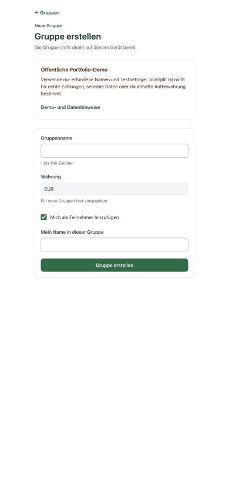
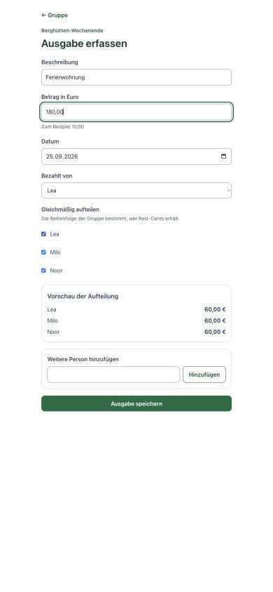
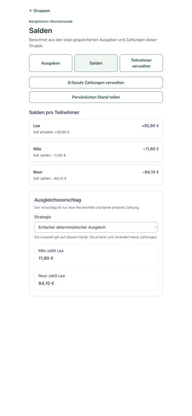

# JoinSplit

JoinSplit is a mobile-first, local-first web application for small groups that
need to record shared expenses, split them evenly, understand balances, and
derive settlement payments without creating user accounts.

> **Release status:** M4 web portfolio release candidate. The canonical demo
> target is [joinsplit.tiny-bits.org](https://joinsplit.tiny-bits.org), but this
> README does not claim that the deployment is live before the production
> verification in JS-032 is complete.

The public release is a portfolio demo for fictional, non-sensitive test data,
not a production financial service or durable record-keeping system. Read the
[demo and data-handling contract](docs/product/portfolio-demo.md) before using
the release candidate.

## Product walkthrough

All screenshots use fictional names and test amounts.

| Public demo boundary | Equal Split preview | Balances and proposal |
| --- | --- | --- |
|  |  |  |
| The limitation is visible before the first group can be created. | Smallest-unit arithmetic produces an explicit, deterministic preview. | Recorded state and derived recommendations remain visibly distinct. |

## Who it is for

JoinSplit is designed for one organiser managing a small group's shared costs
from one browser installation. Participants are entries in the calculation;
they do not receive accounts, invitations, or access to the group.

The project is also an engineering showcase for:

- a Nuxt and TypeScript client with durable IndexedDB state,
- a Laravel API backed by PostgreSQL,
- explicit offline, retry, idempotency, and data-retention boundaries,
- deterministic financial logic tested across TypeScript and PHP,
- mobile-first interaction and automated accessibility checks.

## Current workflow

- Create Groups locally and optionally add the organiser as a Participant.
- Add, rename, deactivate, reactivate, and conditionally delete Participants.
- Create, edit, and delete Expenses using deterministic Equal Split.
- Inspect derived balances and their Expense/Settlement composition.
- Compare deterministic and exact minimum-transfer Settlement Proposals.
- Record real Settlements separately from calculated Proposals.
- Generate a temporary Participant Statement Snapshot for copy or system share.
- Archive and reactivate Groups, or hard-delete Groups without financial history.
- Continue the loaded core workflow without an API connection and synchronize
  queued mutations later.

## Architecture

```text
Nuxt 4 / Vue 3 / Pinia
        │
        ├── IndexedDB: durable local identity, domain state, settings, queue
        │
        └── idempotent mutation synchronization
                         │
                         ▼
                 Laravel application API
                         │
                         ▼
                     PostgreSQL
```

Laravel is the canonical application API. Business rules do not live in Vue
components or Laravel controllers. Pinia coordinates shared runtime state;
IndexedDB stores the browser-bound identity, Groups, Participants, Expenses,
Expense Shares, Settlements, settings, and pending mutations.

Equal Split and Balance Calculation have independent TypeScript and PHP
implementations exercised against shared scenario vectors. Settlement Proposals
remain derived, read-only values and never become financial records implicitly.

More detail is available in the [domain model](docs/architecture/domain-model.md),
[anonymous-access design](docs/architecture/anonymous-access.md), and
[engineering principles](docs/engineering/principles.md).

## Quality and accessibility

The repository verifies the application with:

- Vitest for client domain and application behavior,
- Pest for Laravel, API, persistence, authorization, and domain behavior,
- strict TypeScript checks and production builds,
- Playwright flows from Nuxt through IndexedDB and Laravel to PostgreSQL,
- axe-core checks against relevant WCAG 2.2 A/AA rules,
- explicit 320 px reflow, keyboard, focus, offline, reload, and retry coverage.

These checks provide engineering evidence; they are not a claim of formal WCAG
certification. Manual release QA remains part of M4.

## Honest limitations

- One owner and one browser-bound access identity; no accounts or collaboration.
- No credential recovery or supported cross-device restoration.
- No Service Worker: first load, restart, or reload while offline is not
  guaranteed.
- The server copy is synchronization state, not a user backup.
- The public demo is limited to fictional, non-sensitive test data.
- Automatic server retention replaces a manual server-erasure workflow in M4.
- No payment execution, banking integration, additional split methods, PWA, or
  native packaging.

The precise 30-day access, cleanup, backup, local-reset, and recovery boundaries
are documented in the [public portfolio demo contract](docs/product/portfolio-demo.md).

## Stack

- **Frontend:** Nuxt 4, Vue 3, TypeScript strict, Pinia, Tailwind CSS 4, Nuxt UI
- **Backend:** Laravel, PHP, PostgreSQL, Pest
- **Quality:** Vitest, Playwright, axe-core
- **Showcase deployment target:** one free Render Docker web service in
  Frankfurt and Neon Free PostgreSQL in AWS Frankfurt, behind one canonical
  HTTPS origin

## Local development

The frontend and backend have separate dependency and development commands and
use distinct local development and test databases. Follow the verified
[local development guide](docs/engineering/local-development.md).

```sh
cd frontend
pnpm test:unit
pnpm typecheck
pnpm build
pnpm test:e2e

cd ../backend
composer test
```

Playwright expects a completed frontend build, its Chromium browser install,
and the isolated PostgreSQL test setup described in the development guide.

## AI-assisted development

JoinSplit deliberately uses ChatGPT and Codex for task decomposition,
implementation, review, and integration practice. Product and architecture
decisions remain human-approved, agent work is bounded by explicit task
contracts, and commits and publication require separate human approval. The
[AI development workflow](docs/ai/workflow.md) documents that boundary.

## Repository and license

The public source repository is
[WolfgangSiegert/JoinSplit](https://github.com/WolfgangSiegert/JoinSplit).
JoinSplit is licensed under the [MIT License](LICENSE).
